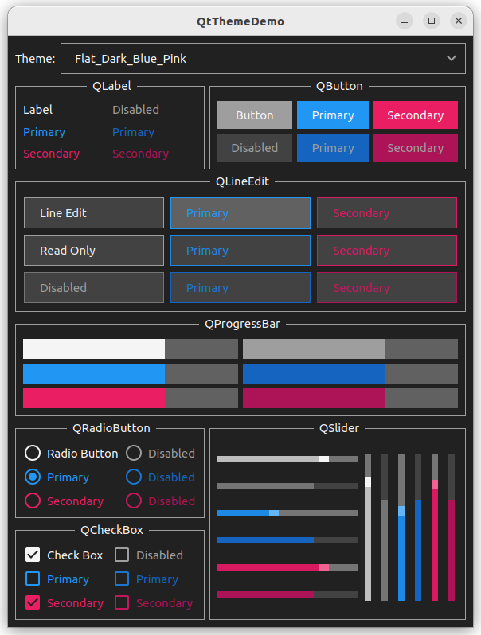
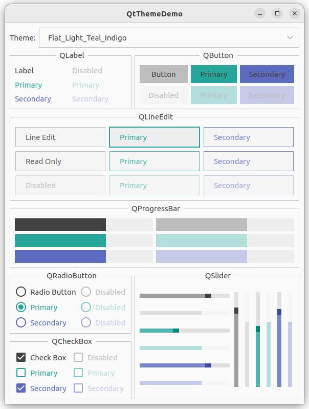

# Qt Theme

Qt theme in pure qss - 纯 qss 的 Qt 主题

> 将 `resource` 目录中的资源加入项目即可

## Preview - 预览





## Notice - 注意事项

自定义的 `QWidget` 子类，必须重载 `paintEvent`，否则样式不会再该类上生效:  

```cpp
void CustomWidget::paintEvent(QPaintEvent *)
{
    QStyleOption opt;
    opt.initFrom(this);
    QPainter p(this);
    style()->drawPrimitive(QStyle::PE_Widget, &opt, &p, this);
}
```
