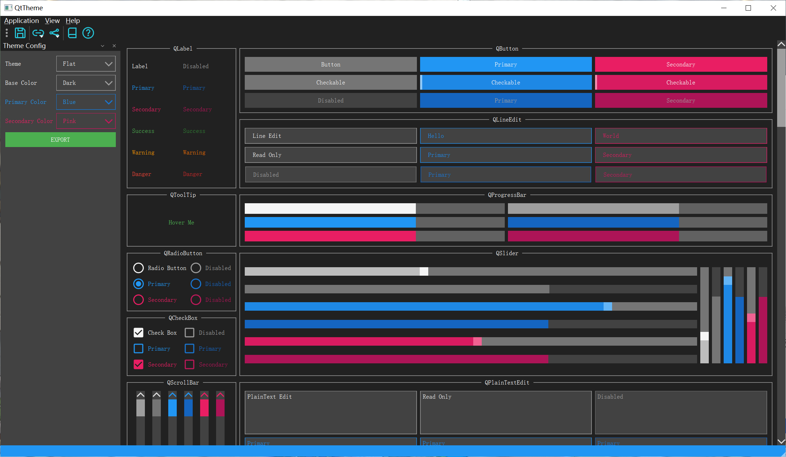
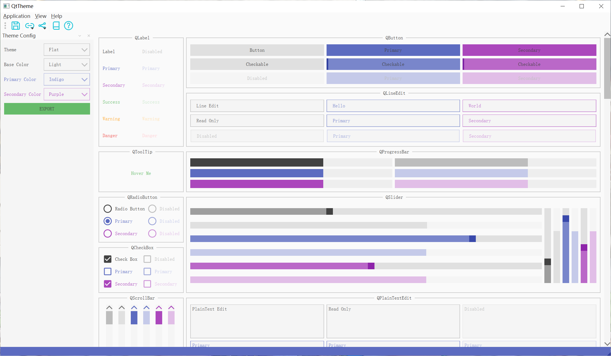

# Qt Theme


Qt theme in pure qss - 纯 qss 的 Qt 主题

[Preview and Export Resource Package Online - 在线预览和导出资源包](https://hubenchang0515.github.io/moe-tools/#/qt-theme)

## Preview - 预览





## Usage - 使用说明

> QtTheme is a pure QSS project, no language restrictions, use C++ description here.

1. Export the resource package from [here](https://hubenchang0515.github.io/moe-tools/#/qt-theme), and add it to your project.

2. Use `QMainWindow::setStyleSheet` to set the global style.
    ```c++
    QFile file(":/QtTheme/QtTheme_Flat_Dark_LightBlue_Indigo.qss");
    file.open(QFile::ReadOnly);
    setStyleSheet(file.readAll());
    ```
3. Use `QWdiget::setProperty` to set the color.
    ```c++
    auto button = new QPushButton(tr("Button"));
    button->setProperty("Color", "Primary");
    ```

| Color        | Explain                                                                    |
| :----------- | :------------------------------------------------------------------------- |
| Primary      | The primary color selected when exporting                                  |
| Secondary    | The secondary color selected when exporting                                |
| Success      | The success color()  |
| Warning      | The warning color() |
| Danger       | The error color()      |

--- 

> QtTheme 是纯 QSS 的项目，不受语言限制，这里使用 C++ 描述。

1. 在[这里](https://hubenchang0515.github.io/moe-tools/#/qt-theme)导出资源包，然后将其加入你的项目。

2. 使用 `QMainWindow::setStyleSheet` 设置全局样式。
    ```c++
    QFile file(":/QtTheme/QtTheme_Flat_Dark_LightBlue_Indigo.qss");
    file.open(QFile::ReadOnly);
    setStyleSheet(file.readAll());
    ```

3. 使用 `QWdiget::setProperty` 设置颜色。
    ```c++
    auto button = new QPushButton(tr("Button"));
    button->setProperty("Color", "Primary");
    ```

| 颜色          | 说明                                                         |
| :----------- | :----------------------------------------------------------  |
| Primary      | 导出时选择的主要颜色                                           |
| Secondary    | 导出时选择的次要颜色                                           |
| Success      | 成功色() |
| Warning      | 警告色() |
| Danger       | 危险色() |

## Notice - 注意事项

Customized `QWidget` subclasses must override `paintEvent`, otherwise the style will not take effect on this class:  

自定义的 `QWidget` 子类，必须重载 `paintEvent`，否则样式不会再该类上生效:  

> https://doc.qt.io/qt-6/stylesheet-reference.html#qwidget-widget

```cpp
void CustomWidget::paintEvent(QPaintEvent *)
{
    QStyleOption opt;
    opt.initFrom(this);
    QPainter p(this);
    style()->drawPrimitive(QStyle::PE_Widget, &opt, &p, this);
}
```


Style will not update itself automatically when the value of a property referenced from the style sheet changes, you must update it manually:  

当样式表引用的属性值发生变化时，样式不会自动更新，必须手动更新:  

> https://wiki.qt.io/Dynamic_Properties_and_Stylesheets

```cpp
// property changes
widget->setProperty("Color", "Secondary");

// update style manually
widget->style()->unpolish(widget);
widget->style()->polish(widget);
```

QComboBox must set the view for the internal style to take effect:  

QComboBox 必须设置 view, 内部的样式才能生效:  

> https://doc.qt.io/qt-6/stylesheet-reference.html#qcombobox-widget

```cpp
comboBox->setView(new QListView);
```

## Python


Install - 安装:  

```bash
pip install QtTheme
```

Usage - 使用:  

See [here](https://pypi.org/project/QtTheme/) - 看[这里](https://pypi.org/project/QtTheme/)

> This method will include all resources of QtTheme. 
> It is recommended to export the resource package from [here](https://hubenchang0515.github.io/QtTheme/), 
> and add it to your project by RCC (`pyrcc5` or `pyside6-rcc`).

> 这种方式将会包含 QtTheme 的全部资源。
> 建议从 [这里](https://hubenchang0515.github.io/QtTheme/) 导出资源包，
> 然后通过 RCC (`pyrcc5` or `pyside6-rcc`) 将它加入你的项目。

## Build - 构建

**Dependencies - 依赖**  

* Deb & Qt5: `qtbase5-dev`, `qttools5-dev`  
* Deb & Qt6: `qt6-base-dev`, `qt6-tools-dev`  
* Rpm & Qt5: `qt5-qtbase-devel`, `qt5-qttools-devel`  
* Rpm & Qt6: `qt6-qtbase-devel`, `qt6-qttools-devel`  

```bash
git clone git@github.com:hubenchang0515/QtTheme.git
cd QtTheme
git submodule update --init
mkdir build
cd build
cmake .. -DCMAKE_BUILD_TYPE=Release
cmake --build . --config Release --parallel
```

## License


* This Project - 这个项目: `AGPL-3.0-or-later` 
* Exported Resource - 导出的资源: `MIT`

## Contributors

